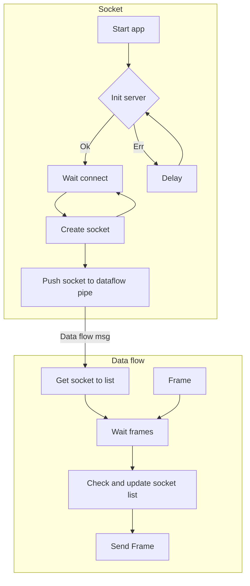

[](https://github.com/ilyajob05/mjpegStreamer/actions/workflows/cmake.yml)


# mjpegStreamer
Simple application for create and translation mjpeg video stream to http webpage use openCV

# Requirements
openCV

# Usage
Set number youre camera 
```
int main(int argc, char *argv[])
{
    cv::VideoCapture camera;
    camera.open(0);

```

`mkdir build`

`cd build`

`cmake ..`

`./mjpegStreamer`


Open browser and connect 127.0.0.1:8080





